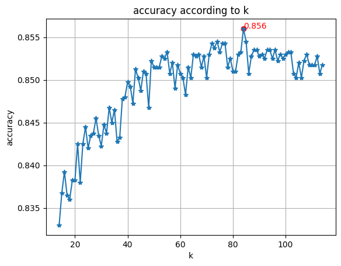

#  Waveform Classification with kNN, PCA & Data Reduction

This project implements and compares **k-Nearest Neighbors (kNN)** together with simple **data reduction techniques** on the classic **`waveform.data`** dataset.  
It also provides a comparison with **Logistic Regression**.

The full study, results, and analysis are available in **[`report.pdf`](./report.pdf)** (recommended read).

---

## Overview

- Dataset: 5000 samples, 21 numerical features, 3 balanced classes
- Train / test split used in the study: 4000 / 1000
- Methods:
  - kNN with cross-validated **k** (search around √n)
  - **RENN** (Repeated Edited Nearest Neighbor) for data cleaning
  - **CNN** (Condensed Nearest Neighbor) for sample reduction
  - **PCA** for feature reduction (2D visualization and higher-dimensional experiments)
  - **Logistic Regression** as a supervised baseline
- Metrics reported: accuracy (primary), precision, recall
- Normalization: Z-score normalization (feature-wise)

> All code required to reproduce the experiments, plots, and metrics is contained in  
> **`waveform_classification.ipynb`**.

---

## Project Structure

├── waveform_classification.ipynb # Experiments, plots, comparisons
├── requirements.txt # Python dependencies
└── report.pdf # Full project report


---

## Key Results (from the report)

### Fine-tuning k


### Data cleaning and reduction


### 1-NN vs 1-NN + CNN (with / without PCA)

| Configuration              | Accuracy | Time (s) | Data shape (train / test) |
|:---------------------------|:--------:|:--------:|:---------------------------|
| **Without PCA**            |          |          |                            |
| 1-NN                       | 0.783    | 0.480    | (4000, 21) / (1000, 21)   |
| 1-NN + CNN                 | 0.763    | 0.129    | (610, 21) / (1000, 21)    |
| **With PCA (2D)**          |          |          |                            |
| 1-NN                       | 0.831    | 0.283    | (4000, 2) / (1000, 2)     |
| 1-NN + CNN                 | 0.870    | 0.076    | (177, 2) / (1000, 2)      |

### kNN vs Logistic Regression (classification)

| Classifier             | Accuracy | Precision | Recall |
|:-----------------------|:--------:|:---------:|:------:|
| kNN (k = 84)           | 0.879    | 0.880    | 0.878  |
| Logistic Regression    | 0.872    | 0.872    | 0.871  |

---

## How to Run

### 1) Set up the environment
```bash
pip install -r requirements.txt
````
2) Prepare the data

Place waveform.data in the project root (same directory as the notebook).

3) Reproduce the experiments
```bash
jupyter notebook waveform_classification.ipynb
````

Inside the notebook you will find:

-Z-score normalization
-Cross-validation for k
-Data cleaning (RENN) and reduction (CNN)
-PCA visualization (2D) and higher-dimensional projections
-kNN and Logistic Regression comparisons

---
Notes

-Classes are balanced (~33% each), making accuracy a meaningful primary metric.
-PCA is applied after normalization.
-Reported runtimes are inference-oriented and depend on hardware.


---
Future Work

Future work should focus on implementing a **KD-Tree** or a **Ball Tree** to speed up kNN inference.  
It could also include comparing kNN performance with other classical machine learning models such as **Random Forests**, **Support Vector Machines (SVM)**, and **Naive Bayes**.

--- 
Authors

Alexis Zawada · Livio Singarin‑Solé
University of Jean Monnet, France
October 2025

